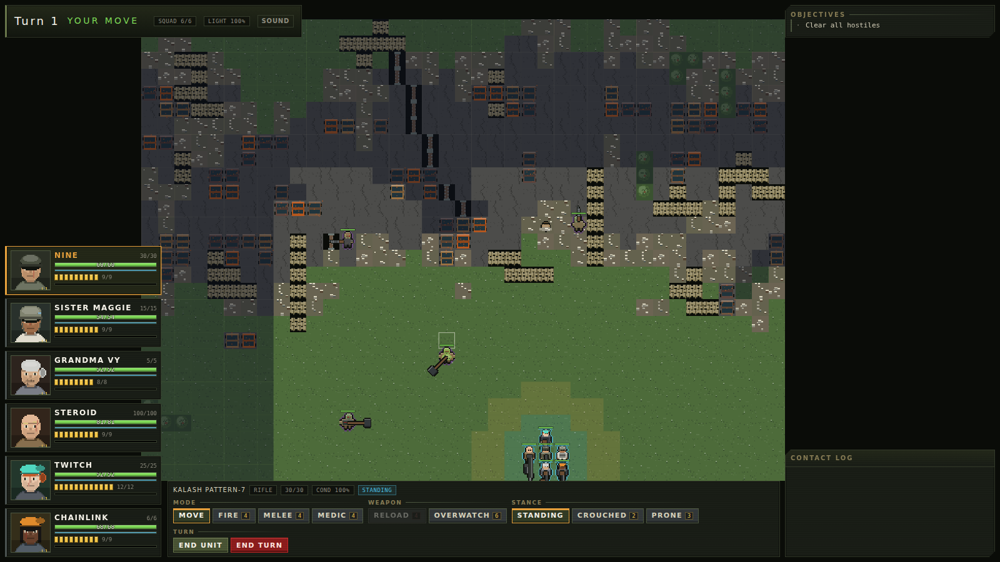
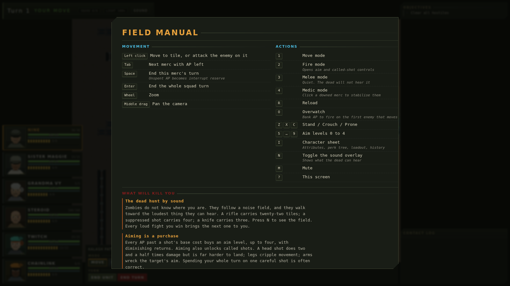

# LAST CONTRACT

**Turn-based tactics in a world eight years dead.**

▶ **[Play it in your browser](https://skurrr.github.io/last-contract/)**

You run Vulture Company, a mercenary outfit in the Basin — eight years after the Grey Fever
turned 99% of humanity into the walking dead. Villages hire you to clear the dead. Factions
hire you to kill each other. You hire the mercs, buy the guns, build the attachments, and
decide which faction lives to see next winter.

Inspired by **Jagged Alliance 2** (a company of unforgettable mercenaries and body-part
gunplay), **Fallout Tactics** (grid combat), and **Project Zomboid** (trait and perk density).



---

## What's in it

### The dead hunt by sound
Zombies have no idea where you are. They follow a **noise field** that propagates across the
map and is muffled by walls, and they walk toward the loudest thing they can hear. A rifle
carries 22 tiles, a suppressed shot 4, a knife 3. Press `N` to see the field they're reading.

This is the single decision that shapes every fight: a suppressor and a machete are not
flavour, they are how you choose when the fight happens. Every loud contract you win brings
the next one to you.

### Tactics with real arithmetic
Action points, three stances, and hit chances you can audit. The shot panel shows the full
breakdown — weapon, skill, range falloff, cover, stance, light, stamina, wounds, morale — so
you always know exactly why a number is what it is.

- **Aiming is a purchase.** Every AP past the base cost buys an aim level (max 4, diminishing),
  and aiming unlocks **called shots**: head ×2.5 damage but far harder, legs cripple movement,
  arms wreck the target's aim.
- **Cover is directional.** A wall protects only against the side it's on. Flanking isn't a
  bonus — it's the removal of a penalty. Cover is destructible; sustained fire chews through it.
- **Burst and auto** with accumulating recoil per round, suppression that pins, weapon
  condition that degrades into jams, and **overwatch interrupts** paid for with banked AP.
- **Down is not dead.** At 0 HP a merc goes Critical with three turns to be reached and
  stabilised. Miss the window and they're gone permanently.

### A company, not a squad
Thirteen hand-written mercenaries — not generated statblocks. Steroid lifts corpses for cardio
and cannot hit a barn. Grandma Vy is 71, the slowest unit in the game, and never misses a
called headshot. Sable never speaks; her barks are stage directions. Sister Maggie will not
fire the first shot.

They have salaries, morale, opinions about each other, and they die permanently.

### Depth to build into
- **93 perks** across five gated trees, **36 traits** (positive cost points, negative refund them)
- **38 weapons** from mil-surplus to pipe guns, **46 attachments** across six slots
- Weapon **crafting** from eight material types — known recipes, or improvised builds whose
  quality scales with your mechanic's skill
- 20 levels, XP for damage, kills, called shots, healing, and learning by doing

### A war to take sides in
An 8×6 sector map whose geography *is* the politics — the Rust Kings hold the highway spine
that separates Havenhold's farms from the Remnant's depot, so you cannot cross the Basin
without paying, fighting, or going the long way through the swamp. Five factions, reputation
from −100 to +100 with alliance and war thresholds, contracts generated from faction state,
salaries that genuinely bite, and a global horde clock that punishes everyone when it fills.

### Everything is drawn in code
No image files, no audio files. Sprites are forged from seeded palettes and shape primitives,
so every merc's face is derived from their id and looks like *them* on the battlefield, in the
roster, and on their character sheet. Sound is synthesised at play time — a suppressor is
audibly a thud, an armour hit rings metallic.



---

## Running it

```bash
npm install
npm run dev        # play at localhost:5173
npm test           # 140 simulation and content-integrity tests
npm run typecheck
npx vite build

# Play hundreds of battles headlessly and report the balance curve
npx tsx scripts/balance.mjs 40

# Boot the built game in a real browser and play through it
npx vite preview & node scripts/smoke.mjs .scratch/shots
```

## Architecture

| Path | Role |
|---|---|
| `src/core/` | Seeded RNG, grid maths, line tracing. No game concepts. |
| `src/sim/` | The deterministic simulation: field queries, combat, turn flow, AI, map generation. Pure data in, events out. |
| `src/data/` | All content: weapons, attachments, perks, traits, mercs, barks, enemies, factions, sectors, recipes. |
| `src/campaign/` | Strategy layer: sectors, factions, contracts, economy, time, saves. |
| `src/art/` | The procedural sprite forge. |
| `src/render/` | Canvas renderer, camera, particles, juice. |
| `src/game/` | Battle controller, event playback, deployment. |
| `src/ui/` | Screens: HUD, character sheet, level-up, campaign, field manual. |
| `tests/` | Vitest suites over the deterministic core. |

The simulation never touches the DOM. It mutates a `BattleState` value and emits
`CombatEvent`s; the presentation layer decides how loud to be about each one. That separation
is what makes battles replayable from a seed, testable headlessly, and balance-tunable at the
scale of hundreds of fights.

Content lives entirely in `src/data/` as plain data, and a test suite asserts every
cross-reference resolves — that no merc holds a perk their attributes can't support, that the
perk graph is acyclic, that every trait exclusion is symmetric.

## Licence

MIT
